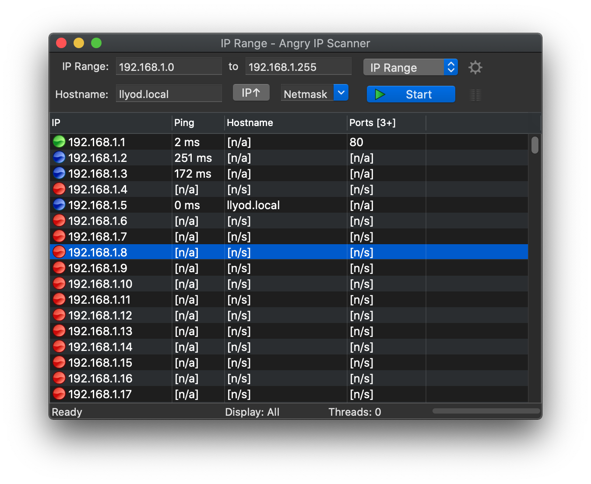
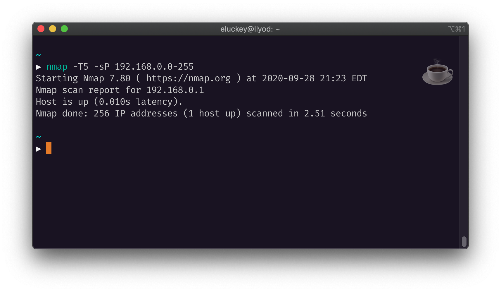
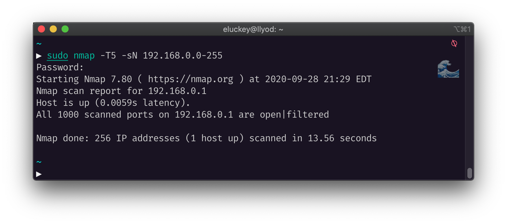
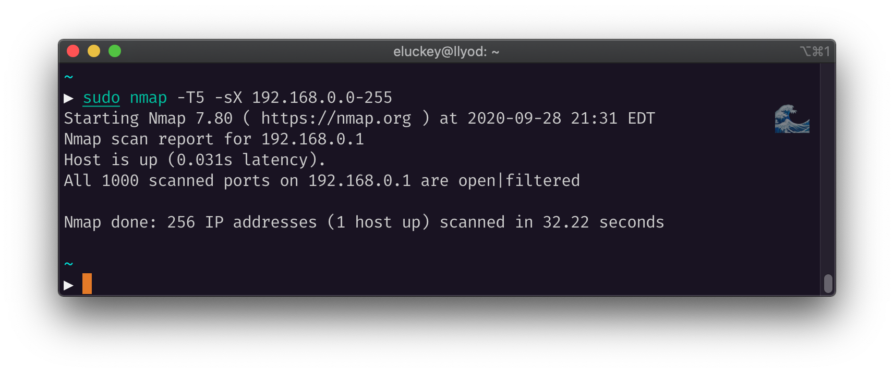
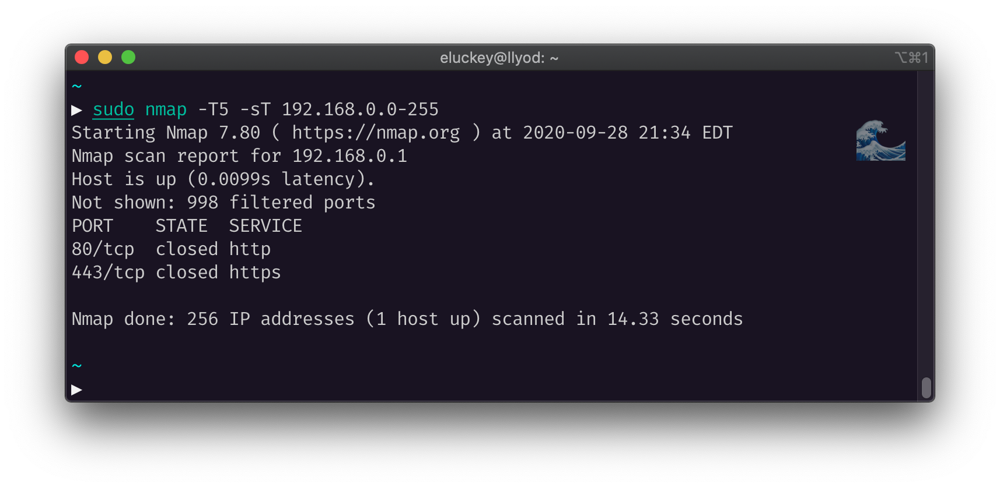
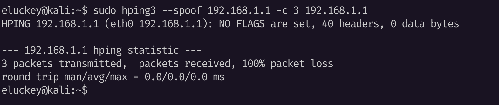

# Lab Homework 4

Elijah Luckey

Sept. 28, 2020

---

## A Ping Sweeping

---

## Port Scanning

### 1.

### 2.

### 3.

### 4.

---

## Packet Crafting

---

## Discussion

Using these tools (`nmap`, `Angry IP Scanner`, and `hping`) can prove useful for testing network
insecurities for local systems. In this experiment, we didn't necessarily find any insecurities (since the connected devices are limited in number on the local network) but can see where each instance of the tools can be useful. The *Angry IP Scanner* and `nmap` tools both showed
`port 80` to be filtered/open in the experiment. Each of those tools can provide very wide scans
on teh network to reveal more open and even vulnerable ports.
