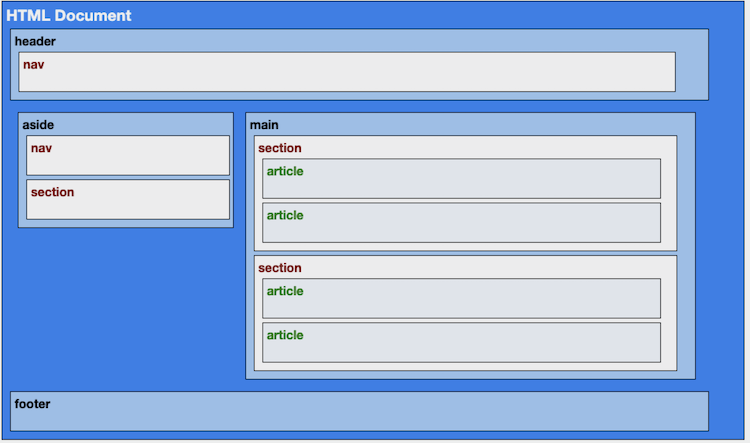

# Assignment: HTML5 Semantic Elements

## Objective

The objective of this assignment is to correctly apply each of the semantic elements of HTML5.

## Assignment Details

In this assignment you are asked to set the semantic structure elements for the following document so that the semantic structure looks like this:

Document (Click here to view the document)

### Resources to use in the page

- Logo: [logo.png](assets/logo.png)
- Image1: [beaglebone-green.jpg](assets/beaglebone-green.jpg)
- Image2: [msp430.jpg](assets/msp430.jpg)
- Image3: [Nucleo-64a.jpg](assets/Nucleo-64a.jpg)

### HTML5 Semantic Elements to Be Used

- header
- main
- aside
- section
- article
- nav
- figure
- footer

## Deliverables

- A zip file of your project folder containing the following documents:
  - HTML code for the document with the HTML5 semantic elements.-
  - images
- Screenshot of the whole page.

> Note: Make sure to download the zip file and decompress the file to make sure that the upload is successful. It is your responsibility to verify that the files are uploaded correctly and successfully.
